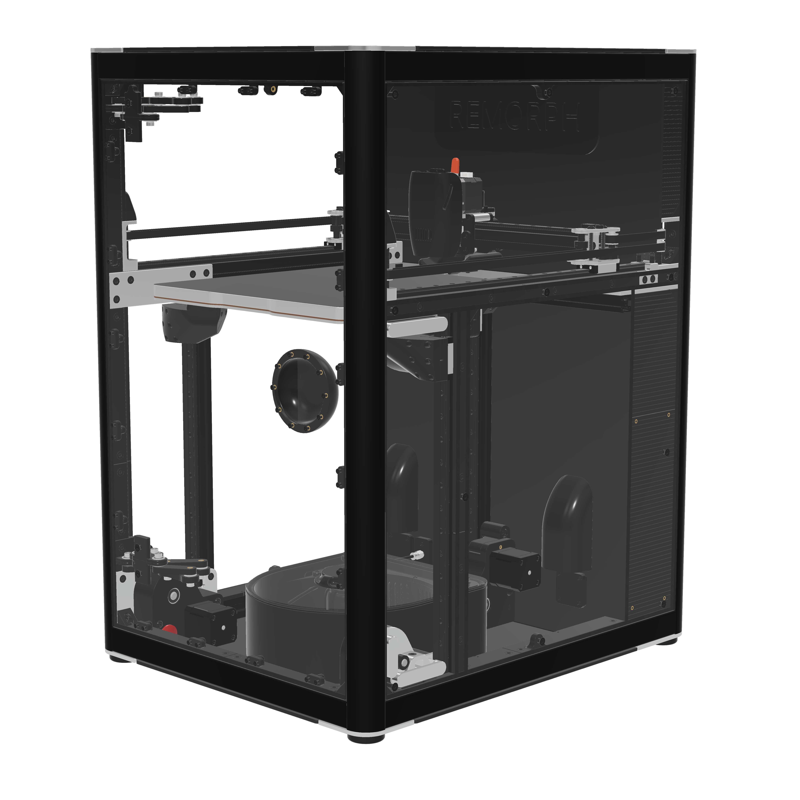

* CPAP for print cooling and chamber convection 

* HEPA and carbon pellets with top-down convection 

* Static core XY 

* Frame made of 3030s and 2020s T-slot extrusions 

* Nearly all mechanical parts are machined aluminum 

* Buildplate with built-in magnets, compatible with eddy sensor.

* 48V N23 servos for X and Y 

* Servos and electronics isolated 

* 9mm belts for X Y Z 

* 12mm linear rails 

* 5:1 gear ratio for Z 

* Maxwell kinematic couplers 

* X307 Y307 Z304mm 

* W460 D560 H720mm 

* Hinges, door handle and connected cables are all internal 

* 4mm panels 

* Sealed internal filament dry box 

* External filament feed possible 

* Optical endstops 

* All idlers and gears use 5mm shafts with 13mm bearings 

* Nozzle wiper with a slide-out bucket

  **For more details, visit [www.remorphdesign.com](https://www.remorphdesign.com)**

  
